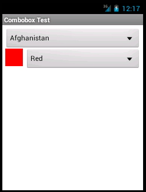
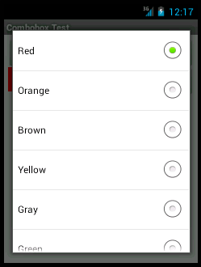

# Combobox Widget Sample

The **Combobox** widget provides a field that allows the user to pick from a list of items.   

On iPhone, this manifests itself as field that is clicked on to produce a picker control.


On iPad, clicking on the field produces a popup with a picker inside.


On Android, this is a plain picker control.




##Manifest
* Version: 1.0 (stable)
* Github: https://www.github.com/orthlieb/widget_combobox
* License: [Apache 2.0](http://www.apache.org/licenses/LICENSE-2.0.html)
* Author: Carl Orthlieb
* Supported Platforms: iOS (iPhone/iPad), Android

## Adding the Combobox Widget to Your Alloy Project

* In your application's config.json file you will want to include the following line in your dependencies:

```
"dependencies": {
    "com.orthlieb.combobox":"1.0"
}
```

*  Create a widgets directory in your app directory if it doesn't already exist.
*  Copy the widget_combobox/widgets/com.orthlieb.combobox folder into your app/widgets directory. 

## Create a Combobox in the View
You can add a Combobox to a view by *requiring* the Combobox widget. 

	<Widget id="color" src="com.orthlieb.combobox"/>

Assign it an ID that you can use in your controller. E.g. `id="color"` You can now access the Combobox via `$.color` in your controller. 

## Initializing the Combobox in the Controller

The combobox doesn't have any choices or selection until you initialize it in your controller. Before you open your window, you will want to call the combobx with the *init* method. For example:

```
var colors = { 
    white: { title: "White", rgb: "#FFFFFF" }, 
    pink: { title: "Pink", rgb: "#FF007F" },
    red: { title: "Red", rgb: "#FF0000" },
    orange: { title: "Orange", rgb: "#FF7F00" },
    brown: { title: "Brown", rgb: "#964B00" },
    yellow: { title: "Yellow", rgb: "#FFFF00" },
    gray: { title: "Gray", rgb: "#848484" },
    green: { title: "Green", rgb: "#00FF00" },
    cyan: { title: "Cyan", rgb: "#00FFFF" },
    blue: { title: "Blue", rgb: "#0000FF" }, 
    violet: { title: "Violet", rgb: "#9400D3" }
};

$.color.init({ 
    left: 40    , 
    top: 40, 
    right: 5, 
    height: Ti.UI.SIZE, 
    borderStyle: Ti.UI.INPUT_BORDERSTYLE_ROUNDED, 
    hintText: 'Select a Color'
}, colors, $.color.id);
```
### Initialization Parameters

| Parameter | Type | Description |
| --------- | ---- | ----------- |
| properties | *object* | You can use any of the properties in the [Ti.UI.TextField](http://docs.appcelerator.com/titanium/latest/#!/api/Titanium.UI.TextField) object to position and style the combobox. |
| choices | *object* | An object containing key/value pairs of choices to present to the user. The value is an object containing a required title and any other private data you wish access to. |
| id | *string* | *Optional.* Selected id in choices to initialize the combobox with. Default: undefined. |

## Accessible Properties and Methods
| Properties | Type | Description |
| ---------- | ---- | ----------- |
| choices | *object* | *Read/Write.* An object containing key/value pairs of choices to present to the user. The value is an object containing a required title and any other private data you wish access to. |
| id | *string* | *Read/Write.* Selected id in choices to set the combobox to. |

## Future Work

There are lots of features that can be added to the Combobox:

* Supporting multiple selection.
* Allowing the user to type in a choice in addition to the choices provided in the dropdown.
* Support for other platforms like Mobile Web and Blackberry.


